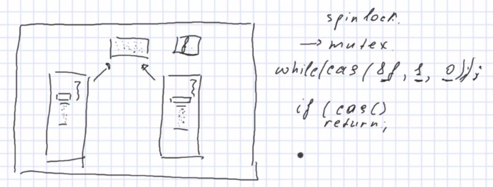

# Блок задач на синхронизацию  

### Для 2.1  

#### Пункт a
Вспомнить, что такое очередь и [как она работает](https://codelessons.dev/ru/ochered-queue-v-c-realizaciya-i-chto-eto-voobshhe-takoe/).   
На примере [стека](https://prepinsta.com/c-program/implementation-of-queues-using-linked-list/)  

#### Пункт b
При изначальном варианте пограммы `./queue-threads` возникали следующие ошибки:  
`ERROR: get value is 4372464 but expected - 4372463
Segmentation fault (core dumped)`  
или просто 
`Segmentation fault (core dumped)`  

#### А почему получаем такие ошибки?  
Потому что много мест в коде, где есть атомарные операции.
Например, операция увеличения счётчика - не атомарна! 
В коде таких операций много: `q->add_attempts++`, `q->count++`, `q->add_count++` и т.д. 
То есть, условно, `counter++` превращается в 3 операции:  
```
movl    $0, -4(%rbp)
addl    $1, -4(%rbp)
movl    -4(%rbp), %eax
```  
То есть в процессе исполнения этих 3х команд, процесс/поток может быть вытеснен, и в эту последовательность исполнения может вмешаться другой процесс/поток.
В общем, атомарные операцици либо происходят полностью, либо нет.  
Если бы эти команды выполнялись как единое целое, то у нас бы была гарантия, что система не вытеснит процесс/поток, пока мы будем в одном процессе находиться; либо, что процессор у нас выполнит эти 3 инструкции как единую команду, тогда бы было все ок. Но это не так. Поэтому все плохо (с)  


**Полезно!** : [Как смотреть core files?](https://unix.stackexchange.com/questions/89933/how-to-view-core-files-for-debugging-purposes-in-linux)  
Или так: 
`./queue-threads`   
`coredumpctl gdb -1`  
В открывшемся окне видим:  
`Storage: /var/lib/systemd/coredump/core.queue-threads.1000.4808e08477e8414eb47fdb2179cb815e.45697.1698337778000000000000.lz4 (inaccessible)`  
Копируем `/var/lib/systemd/coredump/core.queue-threads.1000.4808e08477e8414eb47fdb2179cb815e.45697.1698337778000000000000.lz4 `  
Затем для удобства пишем в терминальчик (например так):  
`sudo cp  /var/lib/systemd/coredump/core.queue-threads.1000.4808e08477e8414eb47fdb2179cb815e.45697.1698337778000000000000.lz4  ./core`  
`sudo chmod ugo+rwx core`  
`mv ./core core.lz4`  
`unlz4 core.lz4`  
`gdb ./core queue-threads`  
Потом жмякаем на enter и пишем `where`

Получим что-то в таком духе:  
```
Program terminated with signal SIGSEGV, Segmentation fault.
#0  0x00005605e73446a1 in queue_get (q=0x5605e81196b0, 
    val=0x7eff212f2ec4) at queue.c:102
102       *val = tmp->val;           // take val of the 1st node
[Current thread is 1 (Thread 0x7eff212f3700 (LWP 45699))]
(gdb) where
#0  0x00005605e73446a1 in queue_get (q=0x5605e81196b0, 
    val=0x7eff212f2ec4) at queue.c:102
#1  0x00005605e7344949 in reader (arg=0x5605e81196b0)
    at queue-threads.c:45
#2  0x00007eff21cf2609 in start_thread (arg=<optimized out>)
    at pthread_create.c:477
#3  0x00007eff21c17133 in clone ()
    at ../sysdeps/unix/sysv/linux/x86_64/clone.S:95
```  
Пытались забрать `tmp`. Посмотрим, что это такое.   
Пишем дальше:  
`p tmp`  
Получаем вот что:  
`$1 = (qnode_t *) 0x0`  
То есть мы пытались разыменовать нулевой указатель.  
Можем еще посмотреть соседние потоки. Пишем:  
`info thread`  
Получаем:  
```
  Id   Target Id                                   Frame 
* 1    Thread 0x7eff212f3700 (LWP 45699)           0x00005605e73446a1 in queue_get (q=0x5605e81196b0, val=0x7eff212f2ec4) at queue.c:102
  2    Thread 0x7eff20af2700 (LWP 45700)           0x00007eff21b92190 in checked_request2size (sz=<optimized out>, req=<optimized out>)
    at malloc.c:3059
  3    Thread 0x7eff21af4700 (LWP 45698)           0x00007eff21bd523f in __GI___clock_nanosleep (clock_id=clock_id@entry=0, 
    flags=flags@entry=0, req=req@entry=0x7eff21af3e80, 
--Type <RET> for more, q to quit, c to continue without paging--
    eff21af3e80) at ../sysdeps/unix/sysv/linux/clock_nanosleep.c:78
  4    Thread 0x7eff21af5740 (LWP 45697) (Exiting) warning: Couldn't find general-purpose registers in core file.
<unavailable> in ?? ()
```  
Наш поток упал в `queue_get`, а соседний(thread 2) - был в `checked_request2size` (не оч пон чо ито)  
Можем написать для более подробной инфы:  
`thread 2`  
`where`  
Чтоб выйти из gdb пишем `quit`  

То есть у нас есть `tmp=0`. Вопрос: почему?  
Потому что поток что-то успелось сделаться, а что-то нет. Эти неатомарные вещи в конкурентной среде происходят несинхронизированно. 

## Общая полезная инфа  
  
Штука, выделенная красным, не атомарна. То есть в процессе исполнения этих 3х команд, процесс может быть вытеснен, и в эту последовательность исполнения:  
```
mov
add
mov
```  
может вмешаться другой процесс.   
Если бы эти команды выполнялись как единое целое, то у нас бы была гарантия, что система не вытеснит процесс, пока мы будем здесь (в левом процессе) находиться; либо, что процессор у нас выполнит эти 3 инструкции как единую команду, тогда бы было все ок. Но это не так. Поэтому все плохо. &copy;

**Классические задачи на синхронизацию**  
Есть некий буфер, в который можно добавлять данные и читать их. 
Есть один поток -writer/производитель/producer - генерирует данные и поток consumer/потребитель/reader - потребляет данные. 

В процессе работы должна быть корректная работы с данными: ничего не должно падать, чтоб сигфолта не было. 

Используем:
1. spin
2. mutex
3. cond var
4. semaphore

**Критическая секция и взаимоблокировки**  
У нас есть кусок программы, в котором мы работаем с какой-то структурой данных и 2 вещи:  
- либо мы предполагаем, что в процессе работы с этим объектом данных, данные консистентны
- либо мы эту консистентность ломаем
  

Короче, моменты, когда мы либо предполагаем, что в участке кода объект, с которым мы работаем, целый; либо мы его временно ломаем, называются **КРИТИЧЕСКИМИ СЕКЦИЯМИ**.   
Для того, чтоб в этих секциях отрабатывать код без проблем, мы используем взаимоблокировки, т.е. делаем так, чтоб вход в эту секцию был доступен только одному какому-то потоку/процессу.  
```
Критическая секция - код, который на время разрушает целостность объекта, либо наоборот требует, чтобы целостность была на протяжении всей его работы.   
Взаимоблокировки - это механизм, который позволяет нам обеспечить работу кода только одним потоком.   
```  
Пусть у нас есть переменная var и 2 потока. Каким образом мы можем обеспечить доступ к этой переменной так, все было норм и ничего не ломалось?  
Можем придумать флаговую переменную, говорим, что она равна 1, то нам можно работать с переменной var, если 0 - то нельзя. 
  
В чем проблема тогда?   
В том, что если один поток успел это условие проверить, зашел в иф, процессорное время закончилось. Второй поток поток тож успел проверить это условие, зашел в иф и получилось так, что оба потока - в критической секции. Тогда код не сработает.

Тогда что нам нужно? Нужна операция, которая гарантированно атомарно сделала бы 2 действия:  
  
Здесь нужна поддержка со стороны процессора.   


### Теория про планирование(shed_yield() в частности), SPINLOCK, FUTEX() 

- [Про планирование в Lunux](https://habr.com/ru/companies/ruvds/articles/578788/)  
- Статья про shed_yield() [number1](https://it.wikireading.ru/1764)  
- [number2](https://it.wikireading.ru/1764)  
- [number3](https://www.halolinux.us/kernel-reference/the-sched-yield-system-call.html)  

#### Про CAS-операции and SPINLOCK
[Почитать тут](https://en.wikipedia.org/wiki/Compare-and-swap#:~:text=In%20computer%20science%2C%20compare%2Dand,to%20a%20new%20given%20value.)  

```
cas(&f, expected, new) {
	if(f != expected) {
		return 0;
	}
	f = new;
	return 1;
}
```  
Передаем адрес переменной f, передаем ожидаемое значение и новое значение.
Идея в том, что функция должна АТОМАРНО поменять значение f на new, если там сейчас находится expected.

##### Примерчик с функцией f  
`cas(&f, 1, 0)`  

То есть:  
1. // 1 -> 0  
Пусть в f была единичка, а мы хотим записать нолик. Сравниваем f с единичкой(2 арг), сравнение прошло успешно, записываем 0. 
2. // 0 -> 0  
Пусть в f был 0, тогда cas не прошел, вернул ошибку.  

Если запишем такое:  
`while(!cas(&f, 1, 0))`, то выйдем из этого цикла только при том условии, если в f удастся положить 0 при том, что там была 1. 
Это есть захват лочки (aka lock). Такая лочка называется spinlock.  


#### Про shed_yield() и немного про futex()  

From the 2nd article украдено:  
```
Состояние «выполняется»

Как только планировщик поставил процесс на выполнение, началось состояние «выполняется». Процесс может выполняться весь предложенный промежуток (квант) времени, а может уступить место другим процессам, воспользовавшись системным вывозом sched_yield.
```

**ПРОДОЛЖЕНИЕ ЛЕКЦИИ ЫЫЫ**  
Что сделает shed_yield? Это сискол, который уйдет в ядро. 
Что значит заблокировать процесс добровольно? 
Процесс может находиться в 3х состояних: `RUN`, `RUNNABLE`, `SLEEP`.  
В `RUNNABLE` оказываемся, когда закончилось процессорное время, а в `SLEEP` - когда что-то случилось: процессорное время есть, но мы не можем им воспользоваться. Например, ожидаем данные из какого-то сокета, или подрубили `shed_yield`.  
Эта функция должна найти структуру task нашего процесса, найти там поле `state` и написать `state = SLEEP`. А потом в shed_yield прописать: `current_state = SLEEEP`.   
И дальше вызываем функцию schedule, который занимается планированием.   
```
shed_yield() {
	current_state = SLEEP;
	schedule();
}
```  
Функция schedule() включилась, видит, что поток в состоянии `SLEEP`, снимает этот поток с исполнения. Берет следующий процесс, точнее его структуру task, берёт его контекст, выставляет там все необходимое окружение.  И затем продолжает исполнение с того места, где закончился предыдущий процесс.   
__А где закончился предыдущий процесс?__   
А он закончился тоже в функции schedule(). Но нам мало просто вытестнить процесс, т.е. просто прописать 
```
task {
	state = SLEEP;
}
```   
будет недостаточно, тк потом процесс надо еще разбудить.  
То есть если функцией shed_yield() мы просто вытесним процесс, то кто разбудит процесс? Ответ: планировщик, когда придет время планировать этот процесс. А мы хотим, чтобы этот процесс проснулся, когда можно захватить лочку (aka lock) &copy;  

Допустим, в ядре есть какая-то функция, которая поместила current_state в `SLEEP`. В это время наша структура `task` поместилась в некий набор структур, который нахолдится в состоянии `SLEEP`.  
```
function1() { 
	current_state = SLEEP;
}       
```  
Но разбудить этот task мы хотим не по тайм-ауту, который прошёл. То есть не хотим, чтоб планировщик разбудил этот процесс, потому что подумал, что пришло время процесса исполняться. Нет.  
Наш task должен ожидать какого-то `event`-a. Это позволит другой функции понять, что процесс (который в `sleep`) ожидает события и прописать `state=RUNNABLE` и поместить его в множество tasks, которые находятся в состоянии `RUNNABLE`.  
```
function2() { 
	current_state = RUNNABLE;
}       
```  
Тогда, когда планироващиу (scheduler) запустится, он сможет из `runnable-процессов` выбрать наиболее достойный и отправить в `RUN`. 
То есть нам нужны 2 такие функии, которые должны быть сисколами:  
1. Первая умеет переводить его в `SLEEP` и как-то помечать, что он ждёт события.  
2. Вторая должна уметь переводить его в состояние `RUNNABLE`, опеределять, что процесс ждёт события и передвать его в `RUN`.  

В Posix это не 2 функции, а одна, но с разными аргументами - `futex()`.  
Это такой швейцарский нож, который на все случаи жизни, умеет много всего. Что-то умеет хорошо, что-то плохо, чем-то пользоваться depricated, потому что слишком много умеет, слишком много может поломать. &copy;Рутман М.В.  

### Про futex() 
Функция нужна для того, чтоб процесс перенести из состояния `RUN` в состояние `SLEEP`, а затем вернуть его в `RUNNABLE` и потом на исполнение.   

```
Когда нам не жалко потратить процессор? Тогда, когда его трата дешевле, чем потеря производительности, которую мы получим при переключении контекста, потери кэша и тд.   
Spinlock-и удобны тогда, когда операции короткие, а если что-то продолжительное, то они не подходят. И тогда используем mutex-ы.  
```

Допустим, у нас есть разделяемая память между ПРОЦЕССАМИ (не тредами). Вот 2 процесса отражены в одну и ту же область памяти, где лажат какие-то данные?  
  
Каким образом нам синхронизовать доступ сюда? 
Надо сделать общую переменную, разместить её в разделяемой памяти и накинуть на неё mutex или spinlock.  

### К 2.2
#### SPINLOCK 
**Пункт C**  

### Сайтики 
- [про spinlock](https://docs.oracle.com/cd/E26502_01/html/E35303/ggecq.html#scrolltoc) 
- [про mutex](https://docs.oracle.com/cd/E26502_01/html/E35303/sync-110.html#scrolltoc) 
- [про mutex-ы & spinlocks](https://stackoverflow.com/questions/5869825/when-should-one-use-a-spinlock-instead-of-mutex)  
- [mutex vs spinlock num1](http://www.alexonlinux.com/pthread-mutex-vs-pthread-spinlock)  


### Хорошо написано 1
Украдено [отсюда](https://stackoverflow.com/questions/5869825/when-should-one-use-a-spinlock-instead-of-mutex) 

**The Theory**

In theory, when a thread tries to lock a mutex and it does not succeed, because the mutex is already locked, it will go to sleep, immediately allowing another thread to run. It will continue to sleep until being woken up, which will be the case once the mutex is being unlocked by whatever thread was holding the lock before. When a thread tries to lock a spinlock and it does not succeed, it will continuously re-try locking it, until it finally succeeds; thus it will not allow another thread to take its place (however, the operating system will forcefully switch to another thread, once the CPU runtime quantum of the current thread has been exceeded, of course).

**The Problem**

The problem with mutexes is that putting threads to sleep and waking them up again are both rather expensive operations, they'll need quite a lot of CPU instructions and thus also take some time. If now the mutex was only locked for a very short amount of time, the time spent in putting a thread to sleep and waking it up again might exceed the time the thread has actually slept by far and it might even exceed the time the thread would have wasted by constantly polling on a spinlock. On the other hand, polling on a spinlock will constantly waste CPU time and if the lock is held for a longer amount of time, this will waste a lot more CPU time and it would have been much better if the thread was sleeping instead.

**The Solution**

Using spinlocks on a single-core/single-CPU system makes usually no sense, since as long as the spinlock polling is blocking the only available CPU core, no other thread can run and since no other thread can run, the lock won't be unlocked either. IOW, a spinlock wastes only CPU time on those systems for no real benefit. If the thread was put to sleep instead, another thread could have ran at once, possibly unlocking the lock and then allowing the first thread to continue processing, once it woke up again.

On a multi-core/multi-CPU systems, with plenty of locks that are held for a very short amount of time only, the time wasted for constantly putting threads to sleep and waking them up again might decrease runtime performance noticeably. When using spinlocks instead, threads get the chance to take advantage of their full runtime quantum (always only blocking for a very short time period, but then immediately continue their work), leading to much higher processing throughput.

**The Practice**

Since very often programmers cannot know in advance if mutexes or spinlocks will be better (e.g. because the number of CPU cores of the target architecture is unknown), nor can operating systems know if a certain piece of code has been optimized for single-core or multi-core environments, most systems don't strictly distinguish between mutexes and spinlocks. In fact, most modern operating systems have hybrid mutexes and hybrid spinlocks. What does that actually mean?

A hybrid mutex behaves like a spinlock at first on a multi-core system. If a thread cannot lock the mutex, it won't be put to sleep immediately, since the mutex might get unlocked pretty soon, so instead the mutex will first behave exactly like a spinlock. Only if the lock has still not been obtained after a certain amount of time (or retries or any other measuring factor), the thread is really put to sleep. If the same code runs on a system with only a single core, the mutex will not spinlock, though, as, see above, that would not be beneficial.

A hybrid spinlock behaves like a normal spinlock at first, but to avoid wasting too much CPU time, it may have a back-off strategy. It will usually not put the thread to sleep (since you don't want that to happen when using a spinlock), but it may decide to stop the thread (either immediately or after a certain amount of time; this is called "yielding") and allow another thread to run, thus increasing chances that the spinlock is unlocked (you still have the costs of a thread switch but not the costs of putting a thread to sleep and waking it up again).

**Summary**

If in doubt, use mutexes, they are usually the better choice and most modern systems will allow them to spinlock for a very short amount of time, if this seems beneficial. Using spinlocks can sometimes improve performance, but only under certain conditions and the fact that you are in doubt rather tells me, that you are not working on any project currently where a spinlock might be beneficial. You might consider using your own "lock object", that can either use a spinlock or a mutex internally (e.g. this behavior could be configurable when creating such an object), initially use mutexes everywhere and if you think that using a spinlock somewhere might really help, give it a try and compare the results (e.g. using a profiler), but be sure to test both cases, a single-core and a multi-core system before you jump to conclusions (and possibly different operating systems, if your code will be cross-platform).


### Хорошо написано 2
Украдено [отсюда](https://www.javatpoint.com/spinlock-vs-mutex-in-operating-system)  

Here, you will learn about the various key differences between Spinlock and Mutex in OS. Some main differences between Spinlock and Mutex in OS are as follows:

- Спин-блокировка - это тип блокировки, которая заставляет поток, пытающийся получить его, проверять его доступность, постоянно ожидая в цикле. С другой стороны, мьютекс - это программный объект, предназначенный для того, чтобы разные процессы могли по очереди использовать один и тот же ресурс.   
- Спин-блокировка временно предотвращает перемещение потока. Напротив, мьютекс может блокировать поток на длительный период времени.  
- Spinlock полезен для ограниченного количества критических секций; в противном случае это приводит к пустой трате циклов ЦПУ. С другой стороны, мьютекс полезен для важных расширенных областей, где частое переключение контекста может привести к увеличению накладных расходов.  
- Spinlock не использует переключение контекста. Напротив, мьютекс предполагает переключение контекста.   
- Процесс в спин-блокировке может не перейти в режим сна во время ожидания блокировки. Напротив, процесс во мьютексе может спать в ожидании блокировки.  
- Spinlock отключает вытеснение. С другой стороны, мьютекс поддерживает вытеснение.  

### Реализация mutex-a  
Украдено [отсюда](https://www.tstu.ru/book/elib3/mm/2016/evdokimov/site/page41.41.html)  

**Мьютекс** — это совместно используемая переменная, которая может находиться в одном из двух состояний: заблокированном или незаблокированном.  
Следовательно, для их представления нужен только один бит, но на практике зачастую используется целое число, при этом нуль означает незаблокированное, а все остальные значения — заблокированное состояние. Для работы с мьютексами используются две процедуры.

1. Когда потоку (или процессу) необходим доступ к критической области, он вызывает процедуру mutex_lock. Если мьютекс находится в незаблокированном состоянии (означающем доступность входа в критическую область), вызов проходит удачно и вызывающий поток может свободно войти в критическую область.

2. В то же время, если мьютекс уже заблокирован, вызывающий поток блокируется до тех пор, пока поток, находящийся в критической области, не завершит свою работу и не вызовет процедуру mutex_unlock. Если на мьютексе заблокировано несколько потоков, то произвольно выбирается один из них, которому разрешается воспользоваться заблокированностью других потоков.

```
  TSL REGISTER,MUTEX	  | копирование мьютекса в регистр и установка его в 1
	CMP REGISTER,#0	      | был ли мьютекс нулевым?
	JZE ok	              |	если он был нулевым, значит, не был заблокирован,поэтому
            						| нужно вернуть  управление вызывающей программе 
	CALL thread_yield	    |	мьютекс занят; пусть планировщик возобновит работу другого потока 
	JMP mutex lock	      |	повторная попытка
	ok:	RET	              |	возврат управления вызывающей программе; 
          						  | будет осуществлен вход в критическую область  

	mutex_unlock:
	MOVE MUTEX,#0	        |	сохранение в мьютексе значения 0
	RET	                  |	возврат управления вызывающей программе
```

У mutex-a есть `owner` - поток, который захватил mutex. Это PID потока/процесса в системе, то, что ядро создает для исполнения управляющую структуру task, у каждой структуры есть свой идентификатор. Так вот `owner` - это он и есть.  

### CONDITIONAL VARIABLE  
Есть один поток, ресурс (консоль, например, куда мы будем чот выводить), есть другой поток.   
В одном потоке делаем `wait_event` какого-то `ivent-a`. И, если этот `ivent` пришёл, делаем `print`. И после этого поток должен отчитаться о том, что сделал `print`; просигналить о каком-то событии.   
В другом потоке делаем аналогично.  
  

Короче говоря, хотим иметь какой-то механизм, который позволит не просто синхронизировать доступ к разделяемому ресурсу, а сообщать другим потокам о том, что возникло какое-то событие.   

В данном примере событие заключается в том, что "я уже напечатал, освободил ресурс, теперь печатай ты, буду ждать события от тебя".   

`Cond var` - это объект, на который   
- можно сделать операцию `wait` и передать туда `cond_var`;  
- просигналить: `signal(condvar)` or `broadcast`;  

Нам нужен какой-то флаг, который равен 1, если печатает 1й поток, и 2, если печатает 2й поток.   
То есть должно быить чот в таком духе:  
  

Все было б норм, если б не одно НО. Что делать, если флаг равен 1? Тогда мы зависнем в бесконечном цикле. А чтоб этого не делать, мы делаем `wait`, который позволяет нам просигналить.  

  
// TODO: поменять фотку))
Синий блок позволяет заблокироваться до возникновения события. А событие определяет у нас не cond_var, а флаг.  
`cond_var` - это способ просигналить, уведомить о том, что какое-то событие произошло. А какое событие произошло - определено вот в этом флаге.   
Потом вы в `while` проверяем, что флаг стал в том состояниии, в котором мы его ожидаем. И выходим из цикла. Потом делаем `printf`, выставляем событие (т.е. пишем flag = 2) и генерим `signal` о том, что событие произошло.   

Как будто всё гуд. Но! Проблема в том, что переменная `flag` - это разделяемый ресурс. И просто так менять его в духе `flag = 2`, `flag = 1` не хорошо.  
Поэтому нам нужна атомарная операция, когда мы уверены, что изменение `state` произойдет атомарно. И поэтому переменную `flag` надо захватить под `mutex`.   

Но! В `while` надо так же проверять этот `flag` под `mutex-ом`. 

Всё жёлтым - критическая секция, поэтому всё под `mutex-ом`.   
ВОПРОС! Если в первом потоке мы захватили `mutex`, то каким образом во втором мы его захватим? Оч просто: в `wait` передаем этот `mutex`, который она разлочит.  
    

То есть мы залочили `mutex`, начинаем проверять `flag`(мы имеем право проверять, мы в залоченном `mutex-e`, всё норм), и `flag` не наш. Тогда мы уходим в `wait`, говорим, что будем ждать на `cond_var-e`.   
Но! Если мы хотим, чтоб этот `flag` поменялся, нам надо разлочить `mutex`. И функция `wait` принимает 2 аргумента: условную переменную и мутекс.   
Поэтому перед тем как устроить ожидание на `cond_var-e`, она разлочивает `mutex`. А после того, как кто-то просигналил, `wait` захватывает `mutex` снова.   
Типа `wait` внутри выглядит как `unlock_mutex`, `wait`, `lock_mutex`.  
`mutex` защищает предикат, по которому мы определяем, что должно происходить: можем мы работать или нет.   

**!!! Важно !!!** `cond_var` используется в связке с `mutex`  

**Почитать можно вот**  
- [С оракла](https://docs.oracle.com/cd/E19455-01/806-5257/6je9h032r/index.html)


### SEMAPHORE  
Читаем 
- [статью](https://habr.com/ru/articles/261273/) 
- [еще статья](https://www.geeksforgeeks.org/use-posix-semaphores-c/)  
- [статья про сравнение mutex and semaphore](https://coderlessons.com/tutorials/akademicheskii/osnovy-operatsionnykh-sistem/3-miuteks-protiv-semafora)  


## Про semaphore & mutex 
- [main article](https://jlmedina123.wordpress.com/2014/04/08/255/)
- [статья](https://greenteapress.com/thinkos/html/thinkos013.html)
- [еще статья](https://see.stanford.edu/materials/icsppcs107/23-Concurrency-Examples.pdf)


**ВАЖНО** _У мьютекса ЕСТЬ OWNER, а у семафора НЕТ OWNER-a_ !!! 
